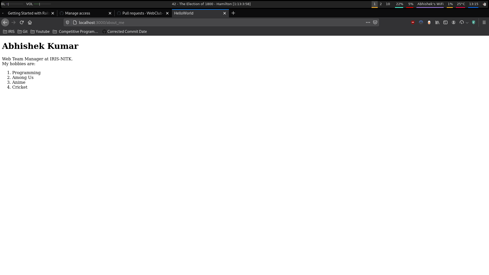

# Session 1 - Getting Started with Rails

The first sesssion is all about getting started with Rails.

We will create a website with two pages - a Home Page and an About Me
page.

The home page just contains a heading with text "Hello, World!" whereas
About Me page is more detailed, with the following elements:
- An heading with your name.
- An paragraph with your bio.
- An ordered list with four of your favorite hobbies.

For example, `@abhishekkumar2718`'s website looks like the following:




> The aim of session 1 is to become familiar with creating rails project
> and collaborating with others through Git. We will be building more
> impressive websites by the end of Bootcamp.

## Steps

- Install [Ruby Version Manager (RVM)]().

- Install Ruby, Bundler and Rails.

- Clone and change directory into the repository

```bash
git clone https://github.com/abhishekkumar2718/IRIS-RoR-Bootcamp-2021.git
cd IRIS-RoR-Bootcamp-2021
```

- Create and checkout a new branch `session_1_<your_name>`. For example:

```bash
git checkout -b session_1_abhishek_kumar
```

- Create a new Rails project `hello_world` in the directory `session_1`:

```bash
cd session_1
rails new hello_world --skip-git
cd hello_world
```

- Run the rails server using below command and go to http://localhost:3000/. 
You should see **Yay! You're on Rails!**.

```bash
rails server
```

- Create a database and run the migrations using:

```bash
rails db:create
rails db:migrate
```

- Generate a new controller `PageController` with actions `root` and
  `about_me`:

```bash
rails generate controller Page root about_me
```

- Copy the test file from `session_1` directory to
  `hello_world/test/controllers`:

```bash
cp page_controller_test.rb hello_world/test/controllers
```

- Edit the routes file (`config/routes.rb`) as follow:

```ruby
Rails.application.routes.draw do
  get '/', to: 'page#root'
  get 'about_me', to: 'page#about_me'
end
```

- Edit the view files (`app/views/page/root.html.erb`,
  `app/views/page/about_me.html.erb`).

- Reload the pages `http://localhost:3000` and
  `http://localhost:3000/about_me` to inspect your changes.

- Execute the test suite to ensure the page works as expected.

```bash
rails test
```

- If the test fails, check the view files and debug the application.

- Once the test works locally, commit your changes and push:

```
git add .
git commit -m 'Solution for Session 1'
# Insert your branch name in the below command
git push --set-upstream origin session_1_abhishek_kumar 
```

- Create a pull request through https://github.com/abhishekkumar2718/IRIS-RoR-Bootcamp-2021/pulls.

- When your code works correctly, you should see `All checks have
  passed` on the pull request page. If not, check the failing tests, fix
  them and push your changes again.

- In case of doubts, you can also comment on the pull request and
  request review from mentors (`abhishekkumar2718`, ``)
